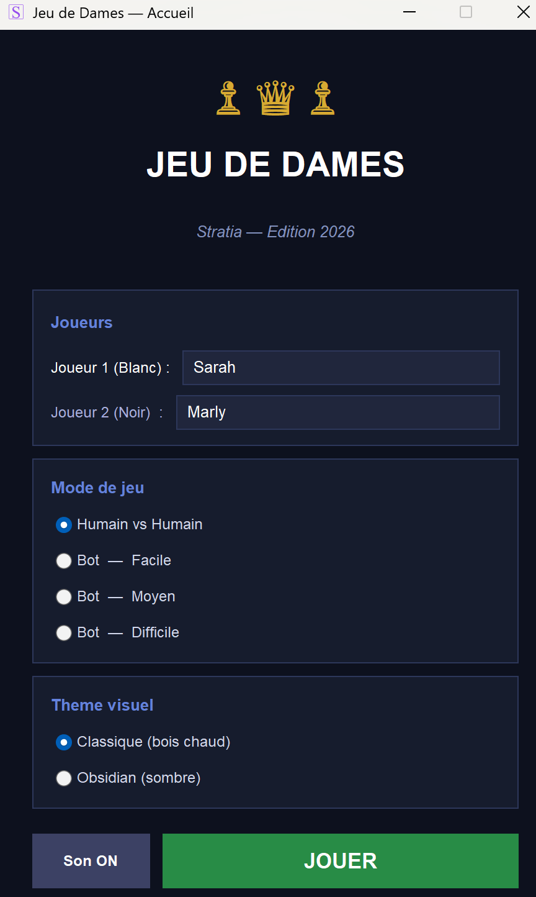
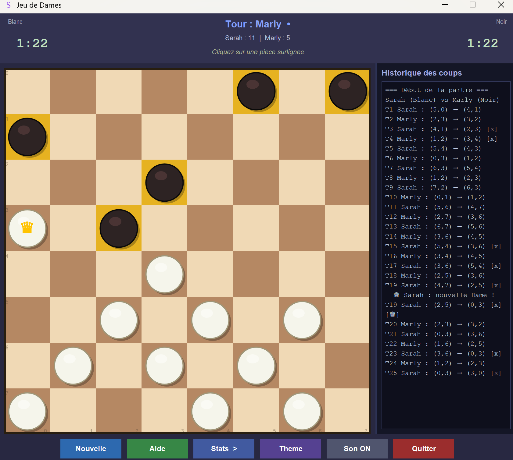

# ♟️ Stratia (Jeu De Dame) — Projet Java B1

> Jeu de dames à deux joueurs, développé en Java avec interface graphique **Swing**.

---

## 👥 Équipe

| Membre | Rôle principal |
|--------|----------------|
| Florence | Modèle (model/) + logique de jeu |
| Sarah | Vue principale (view/) + PlateauPanel |
| Marly | Contrôleur + intégration + README |

---

## 🎮 Fonctionnalités

- ♟ Plateau 8×8 avec règles classiques des dames
- ♛ Promotion automatique en Dame
- ⚡ Captures multiples (prise en chaîne obligatoire)
- 📋 Historique complet des coups (ArrayList)
- 🎨 Interface graphique Swing avec surlignage des coups possibles
- 🔄 Bouton « Nouvelle partie »
- 📖 Fenêtre de règles intégrée

---

## 🛠 Installation & Compilation

### Prérequis
- **Java JDK 11 ou supérieur** installé et accessible dans le PATH
- Vérifier : `java -version` et `javac -version`

### Compiler (Windows)
```batch
compile.bat
```

### Compiler (Linux / macOS)
```bash
chmod +x compile.sh run.sh
./compile.sh
```

### Lancer le jeu
```batch
run.bat          ← Windows
./run.sh         ← Linux/macOS
```

### Manuellement
```bash
# Compilation
javac -d out -sourcepath src src/Main.java src/model/*.java src/view/*.java src/controller/*.java

# Exécution
java -cp out Main
```

---

## 📁 Structure du projet

```
Stratia/
├── src/
│   ├── Main.java
│   ├── model/
│   │   ├── Piece.java          ← Classe abstraite
│   │   ├── Pion.java           ← extends Piece
│   │   ├── Dame.java           ← extends Piece (promue)
│   │   ├── Case.java
│   │   ├── Plateau.java        ← deep copy pour minimax
│   │   ├── Joueur.java
│   │   ├── Coup.java
│   │   ├── Jeu.java            ← règles + historique
│   │   ├── Bot.java            ← IA 3 niveaux minimax
│   │   ├── Chrono.java         ← compte à rebours
│   │   ├── StatsPartie.java
│   │   └── Theme.java
│   ├── view/
│   │   ├── EcranChargement.java  ← préchargement audio
│   │   ├── EcranAccueil.java
│   │   ├── FenetreJeu.java
│   │   ├── PlateauPanel.java
│   │   ├── InfoPanel.java
│   │   ├── HistoriquePanel.java
│   │   ├── StatsPanel.java
│   │   └── EcranResultat.java    ← fin de partie
│   ├── controller/
│   │   └── JeuController.java
│   ├── sound/
│   │   ├── SoundCache.java       ← préchargement WAV
│   │   └── SoundManager.java
│   └── util/
│       └── IconLoader.java       ← logo Stratia
├── sounds/
│   ├── move.wav
│   ├── capture.wav
│   ├── promotion.wav
│   ├── victory.wav
│   ├── defeat.wav
│   └── music.wav
├── assets/
│   ├── icon.png
│   ├── Acceuil.png
│   └── Plateau.png
├── out/
├── compile.bat
├── compile.sh
├── run.bat
└── run.sh
```

---
## 🖼️ Aperçu de l'interface

### Écran d'accueil


### Plateau de jeu



---

## 🎨 Justification du choix de l'interface graphique : **Swing**

Après comparaison des trois principales solutions Java pour les GUI :

| Critère | Swing | JavaFX | AWT |
|---------|-------|--------|-----|
| Intégré au JDK | ✅ Oui | ❌ Non (depuis Java 11) | ✅ Oui |
| Prise en main | ✅ Simple | ⚠️ Courbe d'apprentissage | ❌ Limité |
| Documentation | ✅ Abondante | ✅ Moderne | ⚠️ Ancienne |
| Adapté B1 | ✅ Oui | ⚠️ Complexe (FXML, Maven) | ❌ Déprécié |
| Rendu custom | ✅ paintComponent | ✅ Canvas | ⚠️ Lourd |

**Choix retenu : Swing**

Swing est inclus nativement dans le JDK sans dépendance externe — la compilation
se fait avec un simple `javac`. Sa hiérarchie de classes (`JFrame → JPanel → JComponent`)
s'aligne parfaitement avec les notions de POO vues en cours (héritage, polymorphisme).
La méthode `paintComponent(Graphics g)` offre un contrôle total sur le rendu du plateau,
ce qui était indispensable pour dessiner les cases, les pièces et les surlignages.

---

## 📐 Concepts POO utilisés

| Concept | Où |
|---------|-----|
| **Encapsulation** | Tous les attributs `private`/`protected`, accès via getters/setters |
| **Héritage** | `Pion extends Piece`, `Dame extends Piece`, `FenetreJeu extends JFrame`, `PlateauPanel extends JPanel` |
| **Polymorphisme** | `estDame()` abstraite dans `Piece`, redéfinie dans `Pion` et `Dame` |
| **Collections** | `ArrayList<String>` pour l'historique, `List<Coup>` pour les coups valides |
| **Interface** | `ActionListener`, `MouseAdapter` pour la gestion des événements |
| **Architecture MVC** | `model/` ↔ `controller/` ↔ `view/` strictement séparés |

---

## 📅 Planning prévisionnel (Gantt simplifié)

```
Jour 1 : Conception (classes, architecture MVC, règles),  Implémentation modèle (Piece, Plateau, Jeu, règles),Implémentation vue Swing (plateau graphique, événements)
Jour 2 : Intégration contrôleur + tests + corrections, Finalisation (README, soutenance, nettoyage code)
```

---

## ⚠️ Règles du jeu rappel

- **Pion** : déplacement diagonal vers l'avant uniquement (1 case)
- **Dame** : déplacement diagonal dans toutes les directions (N cases)
- **Capture obligatoire** : si une prise est possible, elle doit être jouée
- **Capture multiple** : une même pièce peut enchaîner plusieurs prises en un tour
- **Promotion** : un pion atteignant la dernière rangée adverse devient Dame (♛)
- **Victoire** : le joueur sans pièces ou sans coup valide perd la partie
